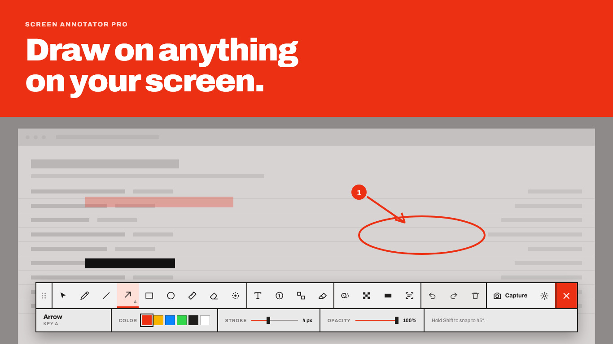
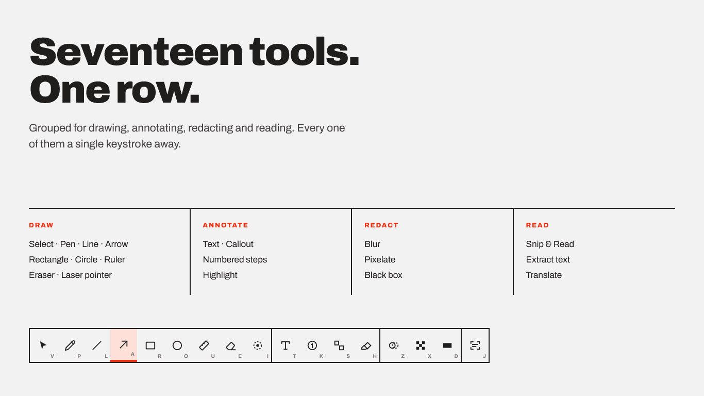
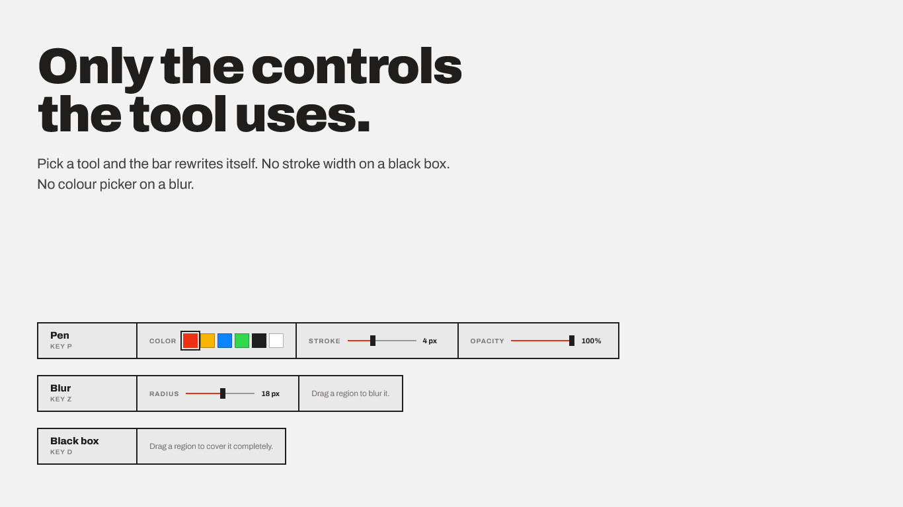
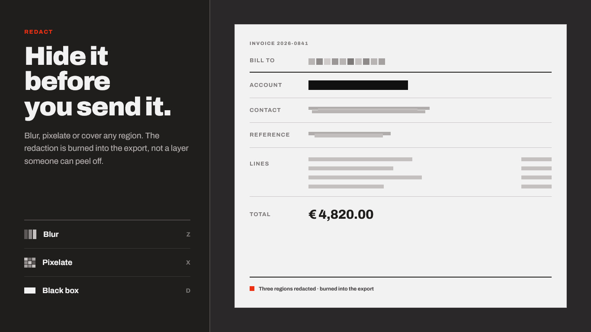
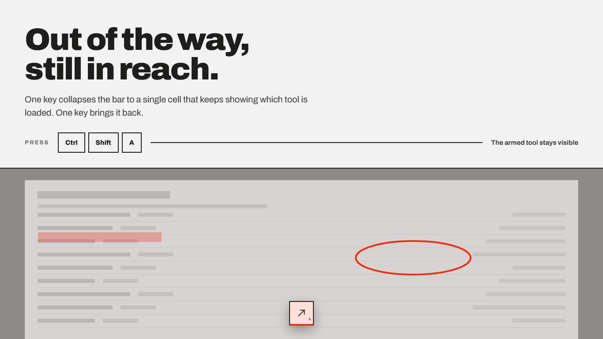

# Screen Annotator Pro

> Draw, highlight, annotate, redact, and OCR anything on your screen — live, in real time, without interrupting what's behind it. Now with **screen recording** built in.

A fullscreen transparent overlay built with **Python + PyQt6**. The overlay sits on top of all windows; you draw on it like a whiteboard, then hide it or clear it when you're done. Everything runs locally — no cloud, no account.

**$0.99** on the **Microsoft Store** · one-time purchase · **Current version: 5.0.1**

Website: [annotator.pro](https://annotator.pro) · Source code: [anelcelik/annotate](https://github.com/anelcelik/annotate) · This repo tracks [issues](https://github.com/anelcelik/annotator.pro.github.io/issues) and hosts this page.

---

## Screenshots

---

## How it works

Screen Annotator Pro creates a transparent, click-through window that covers your entire screen (or all monitors). When you activate it, the overlay intercepts mouse input so you can draw shapes, write text, and apply redactions directly on top of whatever application is underneath. When you hide or pause the overlay, the underlying apps regain full mouse control instantly — no restart, no alt-tab, no disruption.

The app lives in the system tray and is toggled with a global hotkey (`Ctrl+Shift+A` by default) so you can flip it on and off in under a second during a presentation, meeting, or tutorial recording.

---

## Features

### Drawing Tools

| Tool | Key | Description |
|---|---|---|
| Select / Move | `V` | Click and drag any existing shape |
| Pen | `P` | Freehand stroke |
| Line | `L` | Straight line · **Shift** → 45° snap |
| Arrow | `A` | Line with arrowhead · **Shift** → 45° snap |
| Rectangle | `R` | Outline rectangle · **Shift** → perfect square |
| Circle | `O` | Outline ellipse · **Shift** → perfect circle |
| Ruler | `U` | Line with pixel measurement label · **Shift** → 45° snap |
| Eraser | `E` | Freehand erase (width = stroke × 4) |
| Laser Pointer | `I` | Real-time glowing dot — no marks left, OS cursor hidden |

### Annotation Tools

| Tool | Key | Description |
|---|---|---|
| Text | `T` | Place a text label (size controlled by the Text size slider) |
| Callout | `K` | Auto-numbered filled circles |
| Steps | `S` | Auto-numbered step squares |
| Highlight | `H` | Semi-transparent colour band |

### Redact Tools

| Tool | Key | Description |
|---|---|---|
| Blur | `Z` | Gaussian blur over a selected region |
| Pixelate | `X` | Mosaic / pixel-art redaction |
| Black Box | `D` | Solid opaque black redaction |

### OCR & Translate

| Tool | Key | Description |
|---|---|---|
| Snip & Read | `J` | Drag a region → extract text + translate |

That's **17 tools** in total — plus recording, below.

---

## Recording

Press **Record** on the dock (or `Ctrl+Shift+R`) and Screen Annotator Pro
captures the screen with every annotation you draw baked straight into the
video — arrows, callouts, blur, the laser pointer, all of it, at full
resolution. Press it again to stop; the finished MP4 is already on disk.

- **Export to GIF or WebM** afterward in one click, at sensible defaults, or
  pick your own frame rate and size
- **Record a monitor, all of them, or drag out just one area**
- **The dock stays out of the recording.** On Windows it can even stay fully
  visible and usable on your screen the whole time — you still see your
  tools and hotkeys, the video doesn't
- Optional microphone audio, adjustable quality, and a configurable save
  location

---

## OCR & Translation

Press `J` (or `Ctrl+T` by default, configurable in Settings) to activate Snip & Read, then drag a rectangle over any text on screen. A resizable popup appears with:

- **Recognized text** — extracted via [EasyOCR](https://github.com/JaidedAI/EasyOCR), runs fully offline with no API key
- **Translate to** — pick any of 50+ languages and press **Go** to translate via Google Translate
- **Copy** buttons for both the OCR result and the translation

> **First use:** The EasyOCR model (~150 MB) is downloaded once and cached in `%APPDATA%\ScreenAnnotatorPro\ocr_models` (Windows) or `~/.config/ScreenAnnotatorPro/ocr_models` (Linux/macOS). All subsequent uses load instantly from disk.

### Supported translation languages

English, Bosnian, German, French, Spanish, Italian, Portuguese, Dutch, Polish, Russian, Ukrainian, Arabic, Chinese (Simplified), Chinese (Traditional), Japanese, Korean, Turkish, Swedish, Norwegian, Danish, Finnish, Czech, Romanian, Hungarian, Greek, Hebrew, Hindi, Thai, Vietnamese, Indonesian, Malay, Croatian, Slovak, Bulgarian, Serbian, Albanian, Lithuanian, Latvian, Estonian, Slovenian, Catalan, Swahili, Afrikaans, Tagalog, Georgian, Armenian, Azerbaijani, Kazakh, Uzbek, Mongolian.

---

## Keyboard Shortcuts

| Shortcut | Action |
|---|---|
| `Ctrl + Shift + A` | Toggle overlay on / off (customisable in Settings) |
| `Ctrl + T` | Activate Snip & Read / OCR (customisable in Settings) |
| `Ctrl + Shift + R` | Start / stop recording (customisable in Settings) |
| `Ctrl + Z` | Undo last shape |
| `Ctrl + Y` | Redo (restore undone shape) |
| `C` | Clear all shapes |
| `Esc` | Hide overlay (app stays in tray) |
| `Delete` | Remove selected shape (Select tool) |
| **Hold Shift** | 45° snap for lines / perfect square / perfect circle |

---

## Toolbar Controls

A single horizontal dock sits at the bottom of the screen. The top row is every tool, always in the same place; the row below it shows only the properties the *active* tool actually uses — a color swatch and stroke slider for Pen, nothing at all for Select, a radius slider for Blur, and so on.

- **6-colour swatch row** + custom colour picker, when the tool uses colour
- **Opacity slider** (10–100 %), **Stroke size slider** (1–30 px), **Text size slider** (8–72 pt) — shown only for the tools that use them
- **Capture** — hides overlay, captures all monitors, shows Copy / Save PNG / Discard
- **Record** — captures the screen with your annotations baked in; export to GIF or WebM afterward
- **Pause** — hides overlay; resume from tray or hotkey
- **Undo / Redo / Clear all**
- **Settings** — hotkey, OCR hotkey, recording, start on boot, appearance, help reference

**Move it** by dragging the dotted grip at the left end — clicking a tool never moves the dock by accident. **Collapse it** by double-clicking that same grip: it shrinks down to a single draggable icon (the active tool, so you can always tell what's armed) that sits wherever you left it; click it once to expand back to the full dock. Wherever you leave it — collapsed or expanded — is remembered across restarts.

---

## Settings

Open via the **Settings** button in the toolbar.

| Setting | Description |
|---|---|
| Activation Shortcut | Global hotkey to show/hide the overlay (default `Ctrl+Shift+A`) |
| OCR Shortcut | Global hotkey to activate Snip & Read (default `Ctrl+T`) |
| Recording | Area, frame rate, quality, microphone, save location, shortcut (default `Ctrl+Shift+R`) |
| Start on boot | Adds to Windows startup registry; app launches hidden in the tray |
| Appearance | Light or Dark — applies immediately, remembered next launch |

Settings are saved to:
- **Windows:** `%APPDATA%\ScreenAnnotatorPro\settings.json`
- **Linux / macOS:** `~/.config/ScreenAnnotatorPro/settings.json`

---

## Installation

### Microsoft Store
Search **"Screen Annotator Pro"** in the Microsoft Store, or use Store ID **`9NS87MQB29C7`**. **$0.99**, one-time purchase.
The Store version is signed by Microsoft and updates automatically.

### Direct download (Windows)
Grab the latest `.exe` from [GitHub Releases](https://github.com/anelcelik/annotate/releases/latest) —
no install, just run it. Windows SmartScreen will say "Windows protected your
PC" since these aren't Store-signed; click **More info → Run anyway**.

---

## Support

### Bug reports — please include

1. **What happened** — describe the problem and what you expected instead
2. **Steps to reproduce** — the exact sequence of actions that triggers it
3. **Version** — shown in Settings, bottom-right (e.g. `Version 5.0.1`)
4. **OS and display setup** — e.g. Windows 11, single 4K monitor; or Ubuntu 24.04 Wayland, dual monitors
5. **Error message or crash log** (if any) — on Windows, check `%APPDATA%\ScreenAnnotatorPro\` for any log files; on Linux run `python annotate.py` from terminal to see console output
6. **Screenshot or screen recording** (if visual) — helps a lot for rendering or layout bugs

### Feature requests

Open an issue with a clear description of the use case. What are you trying to do, and how does the current app fall short?

### What's in scope

- Drawing, annotation, and redaction tools
- OCR accuracy and language support
- Hotkey reliability and configurability
- Installer / packaging / update issues
- Performance on specific hardware or OS configurations
- Accessibility improvements

### Known limitations

- **Wayland (Linux):** Global hotkeys are not available — use the tray icon to toggle the overlay
- **macOS:** Not officially supported; the app runs from source but no packaged build is provided
- **Multiple monitors:** Overlay covers all monitors; per-monitor mode is not currently supported
- **OCR first-run:** The ~150 MB EasyOCR model downloads on first use; this requires an internet connection once
- **Recording needs ffmpeg** — bundled in the Windows downloads above; installed separately if running from source
- **Keeping the dock visible while recording** is a Windows-only, best-effort feature — everywhere else, and occasionally on Windows too, the dock moves aside or hides for the duration instead

---

## Source code

This repository hosts the [annotator.pro](https://annotator.pro) landing page and tracks issues. The app itself — `annotate.py`, `dock_toolbar.py`, `video_recorder.py`, build/installer scripts — lives in [`annotateVideo/`](https://github.com/anelcelik/annotate/tree/main/annotateVideo) in [anelcelik/annotate](https://github.com/anelcelik/annotate).

---

## License

MIT License — see [License.rtf](https://github.com/anelcelik/annotate/blob/main/archive/before-recording/installer/License.rtf) in the main repo for the full text.

Copyright © 2025–2026 Anel Celik / Casultra

---

## Developer

**Casultra** · [celikovic.xyz](https://celikovic.xyz)
Microsoft Store · Store ID: `9NS87MQB29C7`
